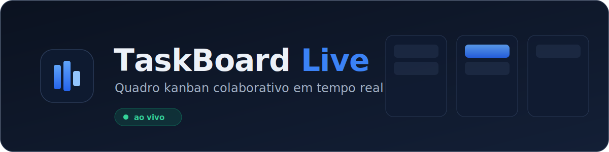
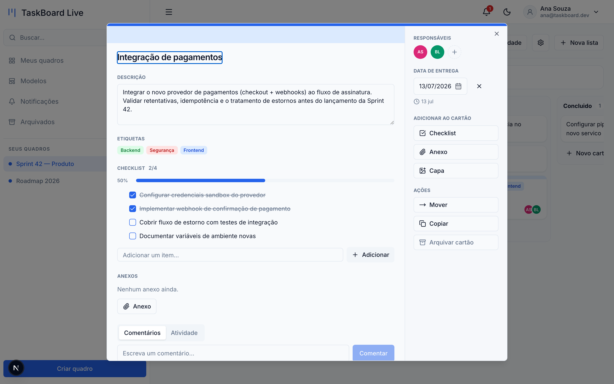
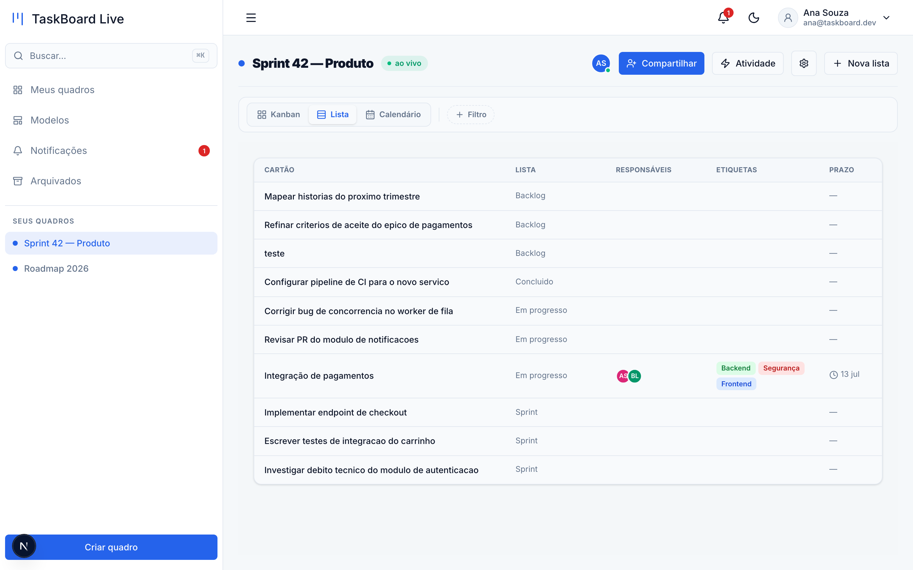
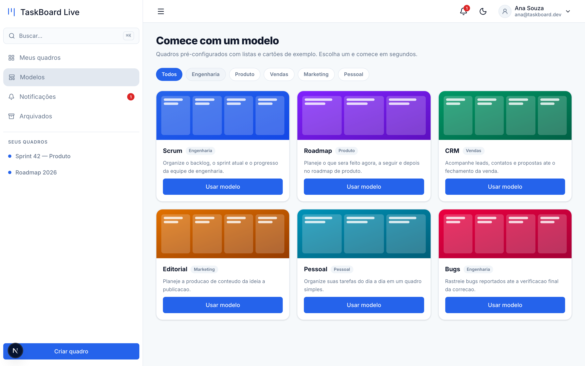
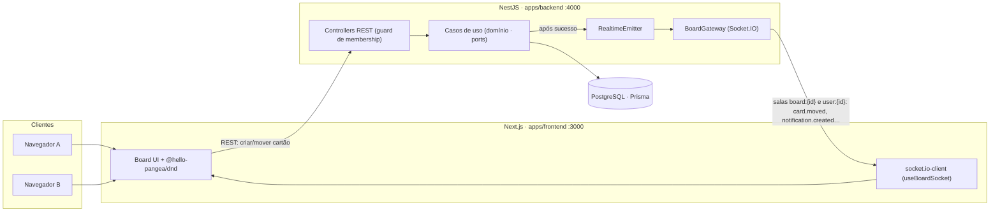

<p align="center">
  
</p>

<h1 align="center">TaskBoard Live</h1>

<p align="center">
  Quadro kanban colaborativo <strong>em tempo real</strong> — estilo Trello, com o rigor de um produto de verdade.<br/>
  Duas pessoas abrem o mesmo quadro e <strong>veem os cartões se moverem ao vivo</strong>.
</p>

<p align="center">
  <a href="https://github.com/editzffaleta/taskboard-live/actions/workflows/ci.yml"></a>
  
  
  
  
  
  
</p>

<p align="center">
  
</p>

---

**Tempo real é o que separa um projeto júnior de CRUD de um que mostra domínio de arquitetura.**
O TaskBoard Live é um kanban colaborativo completo: cada mudança é transmitida por WebSockets para
todos que estão com o quadro aberto — com **update otimista + reconciliação**, **presença** e
**notificações ao vivo**. Cartões ricos (etiquetas, prazo, checklist, responsáveis, comentários,
anexos), **filtros e visões** (Kanban/Lista/Calendário), busca global, modelos e convites por link.
Tudo em **Clean Architecture + DDD**, testado de ponta a ponta e com **CI verde** em cada PR.

## ✨ Funcionalidades

- **Quadros, listas e cartões** com **drag-and-drop** (mover entre colunas e reordenar).
- **Cartão rico** — descrição, **etiquetas** coloridas, **prazo** (badge atrasado/hoje), **checklist**
  com progresso, **responsáveis**, **comentários**, **anexos** (upload), **capa** por cor, e uma aba
  de **atividade** do cartão. Ações: **mover**, **copiar**, **arquivar**.
- **Colaboração ao vivo** — mudanças de outros usuários aparecem **sem recarregar**, via Socket.IO,
  com **presença** (quem está no quadro) e um feed de **atividade** do quadro.
- **Filtros e visões** — filtre por etiqueta/responsável/prazo e alterne entre **Kanban**, **Lista** e
  **Calendário**.
- **Compartilhamento** — convide membros por e-mail ou **link de convite**; autorização **por quadro**
  (`owner`/`member`).
- **Notificações** — sino em tempo real (adicionado a um quadro, atribuído a um cartão, comentários).
- **Busca global** (⌘K), **modelos** de quadro pré-populados, **arquivados** (arquivar/restaurar),
  **configurações** de quadro (cor, etiquetas) e de conta (perfil, senha, tema, idioma).
- **Autenticação** — registro + login com JWT (bcrypt), rotas privadas protegidas; tema claro/escuro; i18n (pt/en).

## 📸 Telas

O **detalhe do cartão** — o coração do produto, com tudo o que um cartão de kanban precisa:

<p align="center">
  
</p>

| Meus quadros | Visão Lista | Modelos | Tema escuro |
|---|---|---|---|
|  |  |  |  |

## 🏗️ Arquitetura

Monorepo Turborepo. Frontend Next.js e backend NestJS conversam por **REST** (mutações) e
**WebSocket** (broadcast em tempo real). O backend segue **Clean Architecture / DDD**: o domínio não
conhece HTTP, Prisma ou Socket.IO — recebe *ports*.



**Como o tempo real funciona:** o cliente conecta passando o JWT em `socket.handshake.auth.token` e
entra na sala `board:{boardId}` (só se for **membro**) e na sala `user:{userId}` (para notificações).
Toda mutação REST, **após** o caso de uso ter sucesso, transmite o evento pela porta `RealtimeEmitter`
(`card.moved`, `card.updated`, `list.moved`, `member.added`, `activity.created`, `notification.created`,
`presence.update`…). O autor da ação vê update otimista; os demais recebem o evento e reconciliam.

### Modelo de domínio (principais entidades)

```
User        { id, name, email, password }
Board       { id, name, ownerId → User, color, archivedAt, createdAt }
BoardMember { id, boardId, userId, role: owner|member, unique(boardId,userId) }
List        { id, boardId, title, position, archivedAt }
Card        { id, listId, title, description?, position, dueDate?, cover?, archivedAt }
  ↳ Label · CardLabel · ChecklistItem · CardAssignee · Comment · Attachment
Activity     { id, boardId, actorId, type, data (json), createdAt }
Notification { id, userId, type, data (json), readAt, createdAt }
Invitation   { id, boardId, email, token, role, status, createdAt }
```

## 🧰 Stack

| Camada | Tecnologia |
|---|---|
| Monorepo | Turborepo + npm workspaces |
| Frontend | Next.js 16 (App Router, TS), `@hello-pangea/dnd`, `socket.io-client` |
| Backend | NestJS 11 (:4000), **Socket.IO gateway** (`@nestjs/websockets`), multer (uploads) |
| Dados | Prisma + PostgreSQL |
| Testes | Jest (unitário/integração, 100% nos casos de uso) + Playwright (e2e) |
| Segurança | helmet, CORS explícito, rate limit (`@nestjs/throttler`), JWT + bcrypt, validação de upload (magic bytes) |
| CI | GitHub Actions: lint · typecheck · build · gitleaks · Semgrep · Trivy · `openspec validate` |

## 🚀 Rodando localmente

**Pré-requisitos:** Node ≥ 22.11, Docker (para o PostgreSQL), npm.

```bash
git clone https://github.com/editzffaleta/taskboard-live.git
cd taskboard-live
npm install

# variáveis de ambiente (modelos versionados)
cp apps/backend/.env.example apps/backend/.env
cp apps/frontend/.env.example apps/frontend/.env

# banco + schema
npm --workspace apps/backend run db:start            # PostgreSQL via Docker
npm --workspace apps/backend run prisma:migrate:deploy

# sobe backend (:4000) + frontend (:3000)
npm run dev
```

Abra <http://localhost:3000>, registre-se, crie um quadro (ou use um **modelo**) — e abra o mesmo
quadro em **duas abas (ou dois navegadores)** com usuários diferentes para ver a colaboração ao vivo.

**Testes:**

```bash
npm run test:e2e     # Playwright, inclui o teste de colaboração ao vivo (2 navegadores)
```

> O e2e sobe backend + frontend reais; veja a pré-condição em `playwright.config.ts`.

## 🧪 Qualidade

- **~300 testes** unitários e de integração; **100% de cobertura** nos casos de uso do domínio.
- **e2e de verdade:** um spec Playwright abre **dois contextos de navegador** (owner + membro),
  move um cartão em um e verifica que o outro vê a mudança **ao vivo, sem reload** — sem flake.
- **CI bloqueante** em cada PR: ESLint (type-aware), `tsc`, build, **gitleaks**, **Semgrep** (com
  Actions fixadas em SHA), `npm audit` e `openspec validate --strict`.

## 📐 Desenvolvimento spec-driven

Cada funcionalidade foi especificada em **[OpenSpec](https://github.com/Fission-AI/OpenSpec)**
(requisitos + design + tarefas) **antes do código**, em **Clean Architecture + DDD**, e entregue em
incrementos pequenos e independentes — **1 funcionalidade = 1 branch = 1 PR** com CI verde. A entrega
foi topológica: fundação (base, design system, auth) → domínio kanban em tempo real → cartão rico,
filtros/visões e configurações → plataforma (arquivados, busca, notificações, modelos, convites) →
anexos e o detalhe completo do cartão.

Os requisitos consolidados vivem em [`openspec/specs/`](./openspec/specs).

## 📄 Licença

[MIT](./LICENSE).
