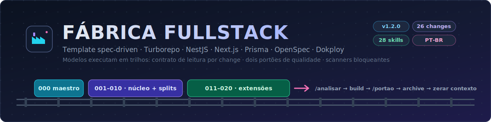

<p align="center">
  
</p>

# Template — Fábrica Fullstack ({{produto}})

Template de desenvolvimento "fábrica fullstack": **NestJS + Next.js + Prisma + Turborepo**
(npm, Jest), **Clean Architecture + DDD**, já com **OpenSpec + git/CI** no fluxo. Você duplica
esta pasta, dispara a orquestração e o sistema é construído mudança a mudança, com dois portões
de qualidade por change — desenhado para que **modelos fracos executem em trilhos**, cada change
cabendo em ≤ ~250k tokens de contexto.

> Este README é a visão geral. O passo a passo operacional está em **[`WORKFLOW.md`](./WORKFLOW.md)**;
> a fonte única para agentes é **[`AGENTS.md`](./AGENTS.md)**.

## Stack

- **Monorepo:** Turborepo + npm workspaces
- **Backend:** NestJS — `apps/backend` (:4000)
- **Frontend:** Next.js 15 (App Router, TS) — `apps/frontend` (:3000)
- **ORM/DB:** Prisma + PostgreSQL
- **Testes:** Jest (unitário/integração) + Playwright (e2e)
- **Processo:** OpenSpec (spec-driven) + git + CI + gate com scanners
- **Entrega:** Dokploy (Traefik + Docker) observando a branch `producao`

## Estrutura

```
.
├── README.md                  ← este arquivo (visão geral)
├── WORKFLOW.md                ← guia operacional passo a passo
├── AGENTS.md                  ← fonte ÚNICA de instruções para qualquer agente
├── CLAUDE.md / GEMINI.md / .cursor/ / .windsurf/ / .github/  ← adaptadores finos (só apontam)
├── SECURITY.md                ← política de segurança do template
├── docs/                      ← auditoria, portabilidade, deploy, segurança, ciclo de vida
├── changes-templates/         ← changes OpenSpec reaproveitáveis (000–010, com splits a/b/c)
│   ├── 000-orquestracao-execucao/   ← o "maestro": como o projeto é construído
│   └── 001…010-*/                   ← núcleo universal multi-tenant
├── .agents/skills → .claude/skills  ← symlink cross-tool
└── .claude/
    ├── settings.json          ← guardrail (nega leitura de .env/segredos/chaves)
    ├── agents/                ← time de agentes (orquestrador + especialistas)
    ├── commands/              ← /inicializar, /orquestrar, /analisar, /portao
    └── skills/                ← catálogo de skills (28 ativas + _arquivadas/)
```

## Portabilidade multi-agente

O `AGENTS.md` é a **fonte única** (o quê, stack, mapa, loop por change, restrições). Claude Code
lê via `CLAUDE.md` (`@AGENTS.md`); Codex, Cursor, Copilot, Windsurf e OpenCode leem o `AGENTS.md`
nativamente; Gemini via ponteiro. Zero conteúdo duplicado — adaptador que cresce é regressão.
Tabela ferramenta→arquivo em `docs/portabilidade.md`.

## O time de agentes (`.claude/agents/`)

Um **orquestrador** dirige; **especialistas** executam por disciplina. Coordenação
**hub-and-spoke**: os especialistas reportam ao orquestrador (eles não conversam entre si por
padrão — peer-to-peer só com Agent Teams, ver abaixo). O handoff tem **formato fixo** nos dois
sentidos (briefing e retorno com campos nomeados — ver `agents/README.md`).

| Agente | Lane | Modelo |
|---|---|---|
| `orchestrator-fullstack` | maestro | opus |
| `architecture-specialist` | bookend (DDD + auditoria de dependência) | opus |
| `security-specialist` | bookend (STRIDE + auditoria OWASP) | opus |
| `backend-specialist` | builder | sonnet |
| `database-specialist` | builder | sonnet |
| `frontend-specialist` | builder | sonnet |
| `e2e-specialist` | builder/gate | sonnet |
| `deploy-specialist` | entrega (Dokploy) | sonnet |
| `openspec-specialist` | processo | sonnet |

## Comandos (`.claude/commands/`)

Todos com **pré-condições verificáveis** no topo.

- **`/inicializar`** — bootstrap de projeto novo (pré-`000`): monorepo + `spec-init`
  (git + OpenSpec + CI/gate) + `spec-conventions` (shared/templates/memory, incl. a **constituição**)
  e cópia das changes para `openspec/changes/`. É o ponto de entrada.
- **`/orquestrar [id]`** — dispara o orquestrador a partir da change `000`; constrói tudo
  sequencialmente. Opcionalmente retoma de uma mudança.
- **`/analisar <id>`** — portão **pré-build** (skill `spec-analyze`): coerência dos artefatos da
  change + conformidade com a **constituição**, antes de implementar. Somente-leitura.
- **`/portao <id>`** — portão **pós-build** (Definition of Done): typecheck nos dois apps, testes,
  `openspec validate --strict` e o **gate com scanners bloqueantes** (gitleaks, npm audit,
  Semgrep, Trivy) — depois de implementar, antes de arquivar/mergear.

## Skills (`.claude/skills/`)

Cada skill é uma pasta com `SKILL.md` (+ `references/`/`assets/` e `agents/openai.yaml`, 28/28).
São a **implementação principal** das tasks das changes. Convenção (frontmatter com gatilho/
anti-gatilho, `compatibility`, corpo ≤150 linhas com progressive disclosure) em
`.claude/skills/README.md`. Grupos: Projeto (`config-project-fullstack`, `spec-init`), DDD/Design
(`ddd-strategic-design`, `security-threat-model`), Base (`config-package-shared`, `config-prisma`,
`backend-nest-config`, `frontend-next-config`), Domínio (`module-*`), Backend (`backend-*`),
Frontend (`frontend-next-config`, `spec-frontend-auth`), Segurança (`backend-authorization`,
`security-review`, `security-threat-model`), E2E (`e2e-playwright`), Deploy (**`deploy-dokploy`**),
Fluxo (`spec-flow`, `spec-analyze`, `spec-conventions`). Legadas em `_arquivadas/`.

## Changes (`changes-templates/`, 000–010 + extensões 011–017)

Núcleo universal multi-tenant em formato OpenSpec, **com trilhos para modelos fracos**: cada
`proposal.md` abre com o **contrato de leitura** (lista fechada do que abrir e do que NÃO abrir);
mockups condicionais em `mockups/<tela>/` (layout fiel + dado real); densas divididas por sufixo
(`006a`/`006b`, `008a`/`008b`/`008c`, `009a`/`009b`/`009c`); ritual de fechamento com
`EXECUTION-LOG.md` + **zerar o contexto** entre changes. As **extensões `011–017`** (e-mail,
hardening HTTP, observabilidade, seeds, e2e, auditoria, sessão rotativa) são opcionais e
recomendadas para produção. Mapa e regras no `changes-templates/README.md`. Versão do template
em `VERSION`/`CHANGELOG.md`.

## Fluxo (resumo)

1. **Bootstrap:** duplique esta pasta e rode **`/inicializar`**.
2. **Placeholders:** troque `{{produto}}`, `{{namespace}}`, papéis e códigos de tela nas changes.
3. **Construção:** rode **`/orquestrar`**. Por mudança: **`/analisar`** (pré-build) → sub-passos
   por especialista (sequencial) → **`/portao`** (pós-build) → archive → commit → ledger →
   `EXECUTION-LOG.md` → **zerar contexto**.
4. **Entrega:** merge de `main` → `producao` publica via Dokploy (`docs/deploy-dokploy.md`).

## Regras de ouro

- Os **princípios inegociáveis** vivem em `openspec/memory/constitution.md`; toda change os
  respeita (exceção só via `## Constitution Exception` no `design.md`).
- Nunca mergeia no `main` com gate/CI vermelho; **scan pulado local nunca é verde definitivo**.
- Nunca commita segredo (`.env`); só `.env.example` é versionado. Env de produção = painel Dokploy.
- 1 change OpenSpec = 1 branch = 1 PR. Deploy só pela `producao` (que só recebe merge de `main`).
- Execução sequencial, nunca paralela (mudanças tocam arquivos compartilhados).
- **Dois portões por change**: `/analisar` (pré-build) → build → `/portao` (pós-build).

## Segurança

Gate bloqueante com **gitleaks + npm audit + Semgrep + Trivy** (local best-effort, CI garante);
`SECURITY.md` semeado por projeto; Dependabot + rulesets (`main` e `producao`) no plano Pro —
o que o Pro não cobre (CodeQL, secret scanning nativo) os scanners OSS cobrem:
`docs/seguranca-github.md`.

## Agent Teams (opcional)

Comunicação peer-to-peer real entre agentes é experimental e desligada por padrão. Habilite com a
env `CLAUDE_CODE_EXPERIMENTAL_AGENT_TEAMS` no `settings.json`/ambiente — os mesmos arquivos de
`.claude/agents/` passam a ser teammates. Reserve para mudanças densas; tem limitações conhecidas.
