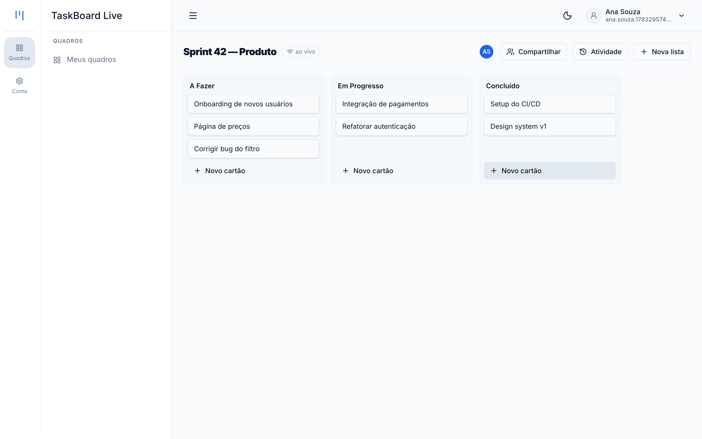
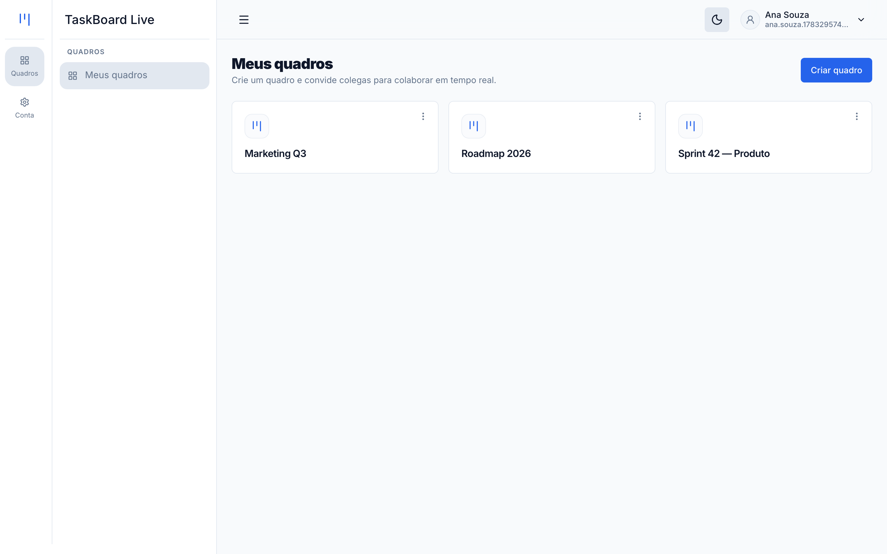
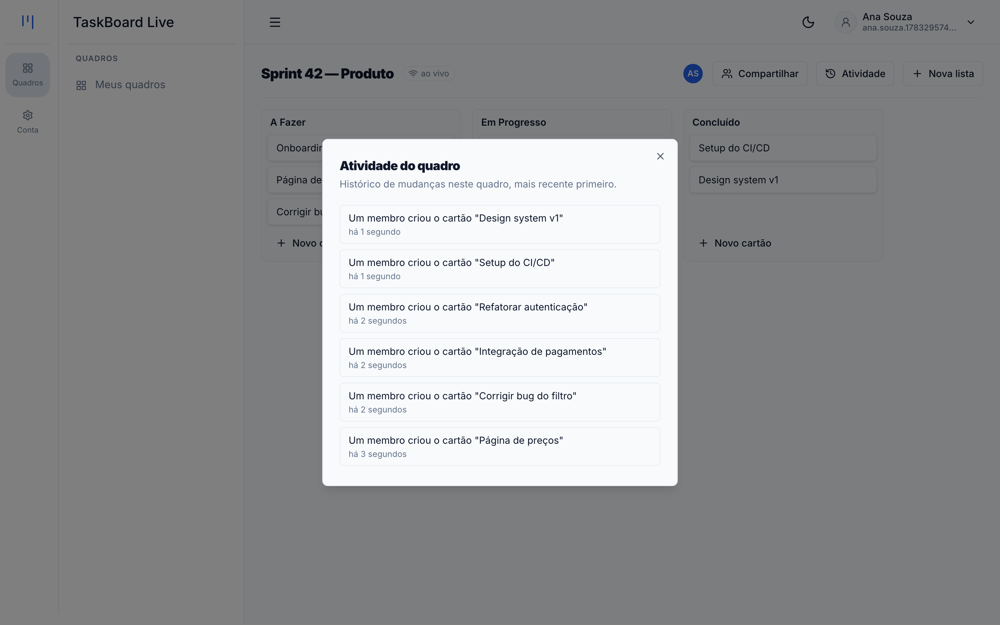
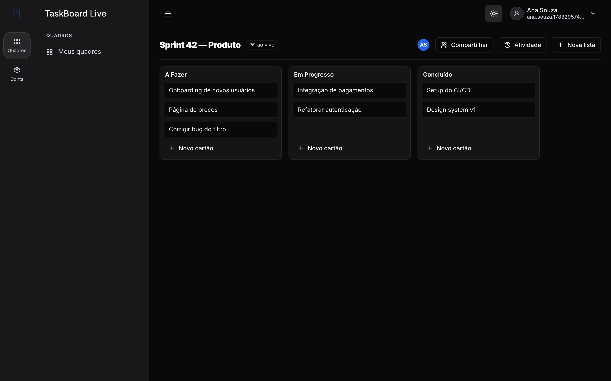
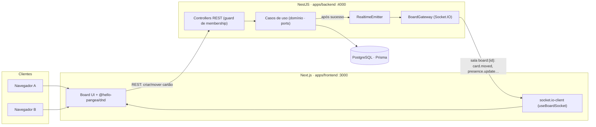

<p align="center">
  
</p>

<h1 align="center">TaskBoard Live</h1>

<p align="center">
  Quadro kanban colaborativo <strong>em tempo real</strong> — estilo Trello simplificado.<br/>
  Duas pessoas abrem o mesmo quadro e <strong>veem os cartões se moverem ao vivo</strong>.
</p>

<p align="center">
  <a href="https://github.com/editzffaleta/taskboard-live/actions/workflows/ci.yml"></a>
  
  
  
  
  
  
</p>

<p align="center">
  
</p>

---

**Tempo real é o que separa um projeto júnior de CRUD de um que mostra domínio de arquitetura.**
O TaskBoard Live é um kanban colaborativo onde cada movimento de cartão é transmitido por WebSockets
para todos que estão com o quadro aberto — com **update otimista + reconciliação**, **presença** e
**feed de atividade ao vivo**. Construído em **Clean Architecture + DDD**, testado de ponta a ponta
(incluindo um teste Playwright que abre **dois navegadores** e prova a sincronização ao vivo) e com
**CI verde** em cada PR.

## ✨ Funcionalidades

- **Quadros, listas e cartões** com **drag-and-drop** (mover entre colunas e reordenar).
- **Colaboração ao vivo** — mudanças de outros usuários aparecem **sem recarregar**, via Socket.IO.
- **Presença** — avatares de quem está vendo o quadro naquele momento.
- **Compartilhamento** — convide membros por e-mail; autorização **por quadro** (`owner`/`member`).
- **Feed de atividade** — "Fulano moveu o cartão X", em tempo real.
- **Autenticação** — registro + login com JWT (senha via bcrypt), rotas privadas protegidas.
- **Tema claro/escuro** persistente, i18n (pt/en).

## 📸 Telas

| Meus quadros | Feed de atividade | Tema escuro |
|---|---|---|
|  |  |  |

## 🏗️ Arquitetura

Monorepo Turborepo. Frontend Next.js e backend NestJS conversam por **REST** (mutações) e
**WebSocket** (broadcast em tempo real). O backend segue **Clean Architecture / DDD**: o domínio não
conhece HTTP, Prisma ou Socket.IO — recebe *ports*.



**Como o tempo real funciona:** o cliente conecta passando o JWT em `socket.handshake.auth.token` e
entra na sala emitindo `board:join {boardId}`; o gateway só admite quem é **membro** (`BoardMember`).
Toda mutação REST, **após** o caso de uso ter sucesso, transmite o evento pela porta `RealtimeEmitter`
(`card.moved`, `card.created`, `list.moved`, `member.added`, `activity.created`, `presence.update`…).
O autor da ação vê update otimista; os demais recebem o evento e reconciliam o estado local.

### Modelo de domínio

```
User        { id, name, email, password }
Board       { id, name, ownerId → User, createdAt }
BoardMember { id, boardId → Board, userId → User, role: owner|member, unique(boardId,userId) }
List        { id, boardId → Board, title, position, createdAt }        // coluna do kanban
Card        { id, listId → List, title, description?, position, createdAt }
Activity    { id, boardId → Board, actorId → User, type, data (json), createdAt }
```

## 🧰 Stack

| Camada | Tecnologia |
|---|---|
| Monorepo | Turborepo + npm workspaces |
| Frontend | Next.js 16 (App Router, TS), `@hello-pangea/dnd`, `socket.io-client` |
| Backend | NestJS 11 (:4000), **Socket.IO gateway** (`@nestjs/websockets`) |
| Dados | Prisma + PostgreSQL |
| Testes | Jest (unitário/integração, 100% nos casos de uso) + Playwright (e2e) |
| Segurança | helmet, CORS explícito, rate limit (`@nestjs/throttler`), JWT + bcrypt |
| CI | GitHub Actions: lint · typecheck · build · gitleaks · Semgrep · Trivy · `openspec validate` |

## 🚀 Rodando localmente

**Pré-requisitos:** Node ≥ 22.11, Docker (para o PostgreSQL), npm.

```bash
git clone https://github.com/editzffaleta/taskboard-live.git
cd taskboard-live
npm install

# variáveis de ambiente (modelos versionados)
cp apps/backend/.env.example apps/backend/.env
cp apps/frontend/.env.example apps/frontend/.env

# banco + schema
npm --workspace apps/backend run db:start            # PostgreSQL via Docker
npm --workspace apps/backend run prisma:migrate:deploy

# sobe backend (:4000) + frontend (:3000)
npm run dev
```

Abra <http://localhost:3000>, registre-se, crie um quadro — e abra o mesmo quadro em **duas abas
(ou dois navegadores)** com usuários diferentes para ver a colaboração ao vivo.

**Testes:**

```bash
npm run test:e2e     # Playwright, inclui o teste de colaboração ao vivo (2 navegadores)
```

> O e2e sobe backend + frontend reais; veja a pré-condição em `playwright.config.ts`
> (banco de pé e `THROTTLE_AUTH_LIMIT` alto por causa do rate limit).

## 🧪 Qualidade

- **~270 testes** unitários e de integração; **100% de cobertura** nos casos de uso do domínio.
- **e2e de verdade:** um spec Playwright abre **dois contextos de navegador** (owner + membro),
  move um cartão em um e verifica que o outro vê a mudança **ao vivo, sem reload** — passa sem flake.
- **CI bloqueante** em cada PR: ESLint (type-aware), `tsc`, build, **gitleaks**, **Semgrep** (com
  Actions fixadas em SHA), `npm audit` e `openspec validate --strict`.

## 📐 Construído spec-driven (OpenSpec)

O sistema foi construído **uma mudança por vez**, cada uma especificada em **OpenSpec** (`proposal` +
`design` + `tasks` + `specs`) antes de qualquer código, seguindo **Clean Architecture + DDD** com um
**time de agentes** (orquestrador + especialistas por disciplina). Foram **13 changes** em ordem
topológica — fundação (base, design system, auth) → domínio kanban (quadros, gateway de tempo real,
listas, cartões, UI ao vivo, membros, atividade) → extensões (hardening, e2e) — cada uma com dois
portões de qualidade (pré-build e pós-build) e **1 change = 1 branch = 1 PR** com CI verde.

- Histórico das changes: [`openspec/specs/`](./openspec/specs) (specs consolidados) ·
  ledger em [`openspec/EXECUTION-LOG.md`](./openspec/EXECUTION-LOG.md).
- Detalhes do processo e do time de agentes: [`AGENTS.md`](./AGENTS.md) ·
  [`WORKFLOW.md`](./WORKFLOW.md) · [`changes-templates/README.md`](./changes-templates/README.md).

## 📄 Licença

[MIT](./LICENSE).
